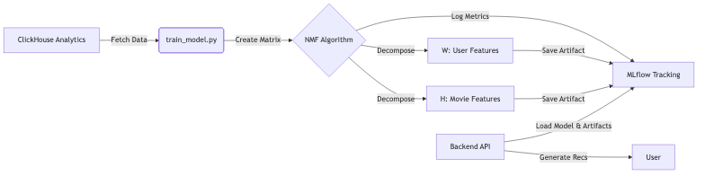

# Collaborative Filtering Guide

This document explains the recommendation system concepts used in the Dataflix project and how they are implemented using MLflow.

## 1. What is Collaborative Filtering?

Collaborative Filtering is a technique used by recommendation systems to predict a user's preference for an item based on the preferences of a group of similar users.

The core underlying assumption is that if User A and User B agreed on issues in the past (e.g., they both liked the same movies), they will likely agree on future issues.

### Types of Collaborative Filtering:
- **User-based**: Recommends items liked by similar users.
- **Item-based**: Recommends items similar to those the user liked.
- **Model-based**: Uses machine learning algorithms to predict ratings. **(Used in Dataflix)**

## 2. Algorithm: Non-negative Matrix Factorization (NMF)

Dataflix uses **NMF (Non-negative Matrix Factorization)**, a model-based collaborative filtering algorithm.

### How it works
NMF decomposes the User-Item Interaction Matrix ($V$) into two lower-dimensional matrices:
1.  **User Matrix ($W$)**: Represents users' affinity to latent features.
2.  **Item Matrix ($H$)**: Represents items' composition of latent features.

$$ V \approx W \times H $$

- **$V$**: Original matrix (Users $\times$ Movies).
- **$W$**: User features (Users $\times$ $k$ components).
- **$H$**: Movie features ($k$ components $\times$ Movies).

The "latent features" ($k$) are hidden characteristics (e.g., "action level", "romance level") that the model learns automatically.

## 3. Implementation in Dataflix

The implementation is located in [`mlflow/train_model.py`](mlflow/train_model.py).

### Data Preparation
1.  **Fetch Data**: Data is queried from ClickHouse (`analytics.mart_user_movie_matrix`).
2.  **Interaction Score**: The system uses an "interaction score" combining explicit ratings (1-5) and implicit actions (watched = 1).
3.  **Matrix Construction**: A pivot table is created:
    -   **Rows**: Users
    -   **Columns**: Movies
    -   **Values**: Interaction Score (0 if no interaction)

### Model Training
We use `sklearn.decomposition.NMF` with the following parameters:
-   **`n_components`**: Number of latent features (calculated dynamically, max 10).
-   **`init`**: 'random' initialization.
-   **`max_iter`**: 200 iterations.

## 4. MLflow Integration

MLflow is used to track experiments, version models, and store artifacts.

### Tracking
Every training run logs the following to MLflow:

-   **Parameters**:
    -   `n_components`
    -   `max_iter`
    -   `matrix_shape` (Users $\times$ Movies)
    -   `algorithm` ("NMF")

-   **Metrics** (Performance indicators):
    -   **RMSE** (Root Mean Squared Error): Standard deviation of prediction errors.
    -   **MAE** (Mean Absolute Error): Average absolute difference between actual and predicted values.
    -   **Sparsity**: Percentage of empty cells in the matrix.
    -   **Reconstruction Error**: How well $W \times H$ approximates $V$.

### Artifacts
Beyond the model itself, we save specific artifacts for the recommendation engine:
1.  **`nmf_model`**: The serialized scikit-learn model.
2.  **`user_features.npy`**: The $W$ matrix (User latent factors).
3.  **`movie_features.npy`**: The $H$ matrix (Movie latent factors).
4.  **`metadata.json`**: Mappings of User IDs and Movie IDs to matrix indices.

## 5. Generating Recommendations

To generate recommendations for a specific user:

1.  **Identify User**: Find the user's index in the matrix.
2.  **Get Features**: Retrieve the user's feature vector from matrix $W$.
3.  **Predict Scores**: Multiply user features by the movie feature matrix $H$.
    $$ \text{Scores} = W_{\text{user}} \times H $$
4.  **Filter**: Remove movies the user has already watched.
5.  **Rank**: Sort remaining movies by predicted score in descending order.
6.  **Recommend**: Return the top N movies.

## 6. Architecture Diagram

